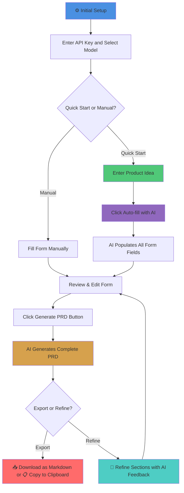

# 📝 AI PRD Creator

[](https://ai-prd-creator.vercel.app/)
[](https://nextjs.org/)
[](https://www.typescriptlang.org/)
[](https://tailwindcss.com/)

An intelligent Product Requirements Document (PRD) generator powered by Google's Gemini AI. Transform your product ideas into comprehensive, professional PRDs in minutes with a beautiful glassmorphism UI inspired by Apple's design language.

🌐 **Live Demo**: [https://ai-prd-creator.vercel.app/](https://ai-prd-creator.vercel.app/)

## ✨ Features

### 🎯 Core Functionality
- **🚀 Quick Start with AI**: Describe your product idea in plain text and let AI auto-fill the entire form
- **📋 Structured Form Input**: Organized sections for all essential PRD components
- **👁️ Live Preview**: See your PRD preview as you type
- **🤖 AI-Powered Generation**: Generate complete, professional PRDs using Gemini AI
- **🔄 Section Refinement**: Refine specific sections with AI-powered feedback
- **📥 One-Click Download**: Export PRDs as Markdown files with smart naming
- **📋 Copy to Clipboard**: Instantly copy generated PRDs

### 🎨 Design & UX
- **💎 Glassmorphism UI**: Beautiful Apple-inspired liquid glass design
- **🌙 Dark Theme**: Eye-friendly dark mode interface
- **📱 Fully Responsive**: Optimized for desktop, tablet, and mobile
- **📲 PWA Support**: Install as a native app on any device
- **⚡ Smooth Animations**: Fluid transitions and interactions
- **🎯 Model Indicator**: Always know which AI model you're using

### 🤖 AI Capabilities
- **🔄 Dynamic Model Selection**: Choose from 40+ Gemini models
- **📡 Live Model Fetching**: Auto-updates with latest models from Google
- **🎛️ Flexible Configuration**: Customize API key and model preferences
- **⏰ Contextual Prompts**: All prompts include current date/time
- **🎯 Smart Defaults**: Pre-configured with Gemini 2.5 Flash
- **💾 Fallback Models**: Works offline with 13 cached models

## 🛠️ Tech Stack

- **Framework**: [Next.js 15.5.4](https://nextjs.org/) with App Router & Turbopack
- **Language**: [TypeScript 5.9.2](https://www.typescriptlang.org/)
- **Styling**: [Tailwind CSS 4](https://tailwindcss.com/) with custom glassmorphism
- **AI**: [Google Gemini API](https://ai.google.dev/) (@google/genai v1.21.0)
- **UI Components**: [Radix UI](https://www.radix-ui.com/) primitives
- **Markdown**: react-markdown with remark-gfm
- **PWA**: next-pwa for Progressive Web App support
- **PDF Export**: jsPDF & docx for document generation

## 🚀 Quick Start

### Option 1: Use the Live Demo (Recommended)
No installation needed! Just visit [https://ai-prd-creator.vercel.app/](https://ai-prd-creator.vercel.app/) and:
1. Click the ⚙️ settings icon
2. Enter your Gemini API key ([Get one here](https://aistudio.google.com/apikey))
3. Choose your preferred model (default: Gemini 2.5 Flash)
4. Start creating PRDs!

### Option 2: Local Development

1. **Clone the repository**
   ```bash
   git clone https://github.com/yourusername/prd-creator.git
   cd prd-creator
   ```

2. **Install dependencies**
   ```bash
   npm install
   ```

3. **Run the development server**
   ```bash
   npm run dev
   ```

4. **Open your browser**
   
   Navigate to [http://localhost:3000](http://localhost:3000)

> **Note**: The app stores your API key locally in your browser. It's never sent to any server except Google's Gemini API.

## 🔑 Getting Your Gemini API Key

1. Visit [Google AI Studio](https://aistudio.google.com/apikey)
2. Sign in with your Google account
3. Click "Get API Key" or "Create API Key"
4. Copy the key and paste it in the settings modal
5. Your key is stored locally in your browser's localStorage

**Privacy**: Your API key never leaves your browser except to call Google's Gemini API directly.

## 🎯 How It Works



## 📱 Progressive Web App (PWA)

AI PRD Creator is a fully installable Progressive Web App!

### Installation

**Desktop (Chrome, Edge, Brave):**
1. Click the install icon (⊕) in the address bar
2. Or click "Install" button in settings
3. App opens in its own window

**Mobile (iOS Safari):**
1. Tap the Share button
2. Select "Add to Home Screen"
3. App appears like a native app

**Mobile (Android Chrome):**
1. Tap the three-dot menu
2. Select "Install App" or "Add to Home Screen"
3. Launch from your home screen

### PWA Features
- ✅ Works offline (cached models)
- ✅ Fast loading with service workers
- ✅ Native app experience
- ✅ No app store needed
- ✅ Auto-updates on launch

## 🎨 Glassmorphism UI

Inspired by Apple's design language, featuring:

- **Frosted Glass Effects**: Backdrop blur with transparency
- **Layered Depth**: Multiple levels of glass panels
- **Smooth Animations**: 60fps transitions and interactions
- **Adaptive Shadows**: Dynamic depth perception
- **Vibrant Colors**: Indigo accents with proper contrast
- **Responsive Design**: Adapts beautifully to all screen sizes

## 🤖 AI Model Selection

### Dynamic Model Fetching
The app automatically fetches the latest available models from Google's Gemini API:
- 40+ models available
- Real-time updates
- Model descriptions and specs
- Input/output token limits

### Model Categories (Auto-sorted)
1. **Gemini 2.5 Flash** - Lightning fast, 1M context (default)
2. **Gemini 2.5 Pro** - Most capable, advanced reasoning
3. **Gemini 2.0 Flash** - Previous generation, stable
4. **Gemini 2.0 Pro** - Previous gen, high quality
5. **Specialized Models** - Embedding, thinking, etc.

### Fallback Models
If API fetch fails, the app uses 13 cached models:
- Gemini 2.5 Flash (stable)
- Gemini 2.5 Pro (stable)
- Gemini 2.0 Flash variants
- All essential models for PRD generation

### Model Display
- 🟢 **Visual Indicator**: Always shows current model in header
- **Display Names**: Official model names from Google
- **Descriptions**: Detailed info for each model
- **Smart Defaults**: Pre-configured with best model

## 🏗️ Architecture

### Project Structure
```
prd-creator/
├── src/
│   ├── app/
│   │   ├── api/
│   │   │   ├── _lib/
│   │   │   │   ├── datetime.ts          # Date/time context helper
│   │   │   │   └── gemini-client.ts     # Gemini API client
│   │   │   ├── generate/route.ts        # PRD generation endpoint
│   │   │   ├── models/route.ts          # Model fetching endpoint
│   │   │   ├── prefill/route.ts         # Form auto-fill endpoint
│   │   │   └── refine/route.ts          # Section refinement endpoint
│   │   ├── layout.tsx                   # Root layout with PWA config
│   │   └── page.tsx                     # Main application page
│   ├── components/
│   │   ├── ui/
│   │   │   ├── macos-window.tsx         # Glassmorphism window
│   │   │   └── section-card.tsx         # Card with glass effect
│   │   ├── button.tsx                   # Reusable button component
│   │   ├── footer.tsx                   # App footer
│   │   ├── header.tsx                   # Header with model indicator
│   │   ├── input-field.tsx              # Text input component
│   │   ├── loader.tsx                   # Loading spinner
│   │   ├── markdown-renderer.tsx        # Markdown display
│   │   ├── prd-display.tsx              # PRD viewer with download
│   │   ├── prd-form.tsx                 # Main form component
│   │   ├── pwa-install-prompt.tsx       # PWA install button
│   │   ├── refine-modal.tsx             # Section refinement dialog
│   │   ├── section.tsx                  # Collapsible section
│   │   ├── settings-modal.tsx           # API key & model settings
│   │   └── textarea-field.tsx           # Multi-line input
│   └── types/
│       └── next-pwa.d.ts                # PWA type definitions
├── public/
│   ├── icon-*.png                       # PWA icons (192, 384, 512)
│   ├── manifest.json                    # PWA manifest
│   ├── sw.js                           # Service worker
│   └── workbox-*.js                    # Workbox cache
├── next.config.mjs                      # Next.js + PWA config
├── tailwind.config.ts                   # Tailwind with glassmorphism
└── package.json                         # Dependencies
```

### API Routes

#### POST `/api/models`
Fetches available Gemini models from Google API.

**Request:**
```typescript
{
  apiKey: string
}
```

**Response:**
```json
{
  "models": [
    {
      "value": "gemini-2.5-flash",
      "label": "Gemini 2.5 Flash",
      "displayName": "Gemini 2.5 Flash",
      "description": "Fast and efficient...",
      "inputTokenLimit": 1048576,
      "outputTokenLimit": 65536
    }
  ]
}
```

#### POST `/api/prefill`
Auto-fills form from a product idea description.

**Request:**
```typescript
{
  apiKey: string,
  model: string,
  productIdea: string
}
```

**Response:**
```json
{
  "data": {
    "productName": "FitFinder",
    "targetAudience": "Health-conscious millennials...",
    "problemStatement": "...",
    "proposedSolution": "...",
    "coreFeatures": "...",
    "businessGoals": "...",
    "futureFeatures": "...",
    "techStack": "...",
    "constraints": "..."
  }
}
```

#### POST `/api/generate`
Generates a complete PRD from structured inputs.

**Request:**
```typescript
{
  apiKey: string,
  model: string,
  inputs: {
    productName: string,
    targetAudience: string,
    problemStatement: string,
    proposedSolution: string,
    coreFeatures: string,
    businessGoals: string,
    successMetrics: string,
    futureFeatures: string,
    techStack: string,
    constraints: string,
    dependencies: string
  }
}
```

**Response:**
```json
{
  "data": "# FitFinder\n\n## 1. Introduction & Vision\n\n..."
}
```

#### POST `/api/refine`
Refines a specific section based on user feedback.

**Request:**
```typescript
{
  apiKey: string,
  model: string,
  currentInputs: { /* current form state */ },
  sectionTitle: string,
  userFeedback: string
}
```

**Response:**
```json
{
  "data": {
    "productName": "...",
    "problemStatement": "...",
    "proposedSolution": "..."
  }
}
```

### Date/Time Context

All AI prompts automatically include:
```typescript
Current Date: January 21, 2025
Current Time: 3:45 PM PST
```

This ensures:
- Time-relevant recommendations
- Current technology suggestions
- Accurate market context

## 💡 Example Use Case

**Product Idea**: "A mobile app for finding and booking local fitness classes"

### Quick Start Flow:
1. Click ⚙️ settings, enter your Gemini API key
2. Enter the idea: "A mobile app for finding local fitness classes"
3. Click "Auto-fill Form with AI ✨"
4. AI generates:
   ```
   Product Name: FitFinder
   Target Audience: Health-conscious millennials aged 25-40...
   Problem Statement: People struggle to discover local fitness classes...
   Proposed Solution: A mobile app that aggregates...
   Core Features:
   - Interactive map view of nearby classes
   - Real-time availability
   - In-app booking
   - User reviews and ratings
   ...
   ```
5. Review and adjust as needed
6. Click "Generate PRD" → Get a comprehensive PRD!
7. 📥 Download as `fitfinder_prd_2025-01-21.md`

## 🚀 Building for Production

```bash
# Install dependencies
npm install

# Build the application
npm run build

# Start production server
npm start

# Or deploy to Vercel with one click
vercel deploy
```

## 🧪 Development

```bash
# Run development server with Turbopack
npm run dev

# Run linting
npm run lint

# Build for production
npm run build
```

## 🌟 Key Features Explained

### 1. 💎 Glassmorphism UI
Inspired by Apple's design language with:
- **Frosted glass panels** with backdrop blur
- **Layered depth** with multiple glass layers
- **Smooth transitions** at 60fps
- **Adaptive shadows** for depth perception
- **Vibrant gradients** with proper contrast

### 2. 🤖 Smart AI Integration
- **Dynamic model selection** from 40+ Gemini models
- **Contextual prompts** with date/time
- **Structured JSON responses** for consistency
- **Section-based refinement** for iterative improvements
- **Fallback models** for offline reliability

### 3. 📱 PWA Capabilities
- **Installable** on any device
- **Offline support** with service workers
- **Fast loading** with Workbox caching
- **Native app feel** in standalone mode
- **Auto-updates** on app launch

### 4. 📥 Export Options
- **Markdown download** with smart file naming
- **One-click copy** to clipboard
- **Future formats**: PDF, DOCX (libraries ready)
- **Version control friendly** markdown format

### 5. 🔒 Privacy First
- **Client-side API key storage** (localStorage)
- **No server-side key storage**
- **Direct API calls** to Google only
- **No tracking or analytics**
- **Open source** for transparency

## 🎨 Glassmorphism Design System

### Color Palette
```css
--glass-bg: rgba(15, 23, 42, 0.7)          /* Slate 900 with opacity */
--glass-border: rgba(148, 163, 184, 0.1)   /* Slate 400 with opacity */
--accent-primary: #6366f1                   /* Indigo 500 */
--accent-secondary: #818cf8                 /* Indigo 400 */
```

### Glass Effects
```css
backdrop-filter: blur(16px) saturate(180%);
background: linear-gradient(
  135deg,
  rgba(255, 255, 255, 0.1),
  rgba(255, 255, 255, 0.05)
);
border: 1px solid rgba(255, 255, 255, 0.1);
box-shadow: 
  0 8px 32px 0 rgba(0, 0, 0, 0.37),
  inset 0 1px 0 0 rgba(255, 255, 255, 0.1);
```

## 📊 Component Architecture

### State Management
```typescript
// Main application state
const [apiKey, setApiKey] = useState<string>('')
const [selectedModel, setSelectedModel] = useState<string>('gemini-2.5-flash')
const [modelDisplayName, setModelDisplayName] = useState<string>('Gemini 2.5 Flash')
const [productIdea, setProductIdea] = useState<string>('')
const [formInputs, setFormInputs] = useState<FormInputs>({})
const [generatedPRD, setGeneratedPRD] = useState<string>('')
const [isGenerating, setIsGenerating] = useState<boolean>(false)
```

### Data Flow
```
User Input → Form State → API Call → Gemini AI → Response → Display
     ↓                         ↓                      ↓
localStorage            Date/Time Context      Markdown Render
                        Model Selection         Copy/Download
```

## 🔧 Configuration

### No Environment Variables Required!
The app uses **client-side configuration only**:
- API keys stored in browser localStorage
- Model preferences saved locally
- No `.env` file needed
- No server-side secrets

### Optional Server Deployment Variables
If you want to provide a default API key (not recommended):
```bash
# .env.local (optional, not recommended)
NEXT_PUBLIC_GEMINI_API_KEY=your_key_here
```

## 📱 PWA Installation Guide

### Desktop
1. Visit [https://ai-prd-creator.vercel.app/](https://ai-prd-creator.vercel.app/)
2. Look for install icon in address bar (⊕)
3. Click "Install" or use settings button
4. App opens in standalone window

### iOS (Safari)
1. Open in Safari browser
2. Tap Share button (square with arrow)
3. Scroll down, tap "Add to Home Screen"
4. Tap "Add" in top right
5. App icon appears on home screen

### Android (Chrome)
1. Open in Chrome browser
2. Tap three-dot menu
3. Tap "Install app" or "Add to Home Screen"
4. Confirm installation
5. Launch from home screen or app drawer

## 🤝 Contributing

Contributions are welcome! Here's how:

1. Fork the repository
2. Create a feature branch (`git checkout -b feature/amazing-feature`)
3. Make your changes
4. Test thoroughly (`npm run dev`)
5. Commit your changes (`git commit -m 'Add amazing feature'`)
6. Push to the branch (`git push origin feature/amazing-feature`)
7. Open a Pull Request

### Development Guidelines
- Follow existing code style
- Add TypeScript types for all new code
- Test on desktop and mobile
- Ensure PWA functionality works
- Update documentation if needed

## 📄 License

This project is licensed under the MIT License - see the LICENSE file for details.

## 🙏 Acknowledgments

- **AI**: Powered by [Google Gemini AI](https://ai.google.dev/)
- **Framework**: Built with [Next.js](https://nextjs.org/) and React
- **UI Components**: [Radix UI](https://www.radix-ui.com/) primitives
- **Styling**: [Tailwind CSS](https://tailwindcss.com/) v4
- **PWA**: [next-pwa](https://github.com/shadowwalker/next-pwa)
- **Icons**: [Radix Icons](https://www.radix-ui.com/icons)
- **Markdown**: [react-markdown](https://github.com/remarkjs/react-markdown)

## 🌐 Live Demo

**Visit**: [https://ai-prd-creator.vercel.app/](https://ai-prd-creator.vercel.app/)

**Features to Try:**
1. ⚙️ Configure your API key (free from Google AI Studio)
2. 🚀 Use Quick Start to auto-fill a form
3. 👁️ See live preview as you type
4. 🤖 Generate comprehensive PRD
5. 🔄 Refine sections with AI feedback
6. 📥 Download your PRD as Markdown
7. 📱 Install as PWA on your device

---

**Made with ❤️ using Gemini AI**

[](https://vercel.com/new/clone?repository-url=https://github.com/yourusername/prd-creator)
